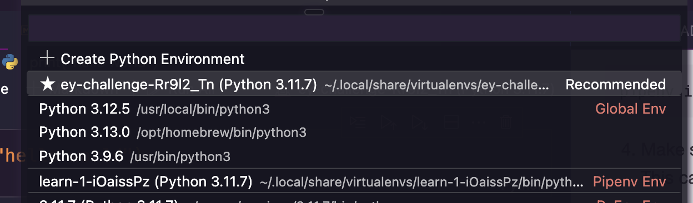

# UHI Model

## Installation 

1. Run the command in your terminal to clone the project to your directory
```
git clone https://github.com/Tharshen2124/ey-challenge.git
``` 


2. Ensure pipenv is installed. If not, install by pasting this command to the console:
```
pip install pipenv
```

3. Once pipenv is ensured to be installed, run the command below. This installs the packages and developer dependecies that is found in the Pipfile.
```
pipenv install
```

4. Make sure to select the kernel that is following the virtual enviroment version. This can be done by:

a) Select the top right button on vs code. It looks like the image below.


b) Go to select kernel.


c) Select the python environments


d)You should see something like ey-challenge-blah blah blah. That is your virtual environment for this project. Select that


e) Now you should be able to run the play button!
